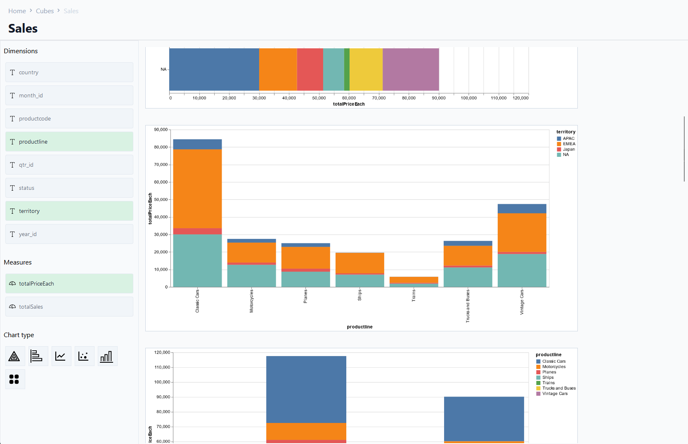

# easy-bi
A simple and easy Business Intelligence (BI) tool

For now this is just a collection of BI-related packages / .hs files that I have been working on for various projects. I'm going to collect them in this repository and will try to combine them into a single well-formed library.

## Packages

### `easy-bi-vis`

Implementation of [_Automating the design of graphical presentations of relational information_](https://dl.acm.org/doi/10.1145/22949.22950) by Jock Mackinlay (ACM Transactions on Graphics 5, 2 (1986) 110-141). Defines a set of rules for assigning dimensions to channels to create sensible visualisations of relational data.

### `easy-bi-sql`

SQL type checker (WIP). Mostly based on the technical report [_Generalizing Hindley-Milner Type Inference Algorithms_](https://www.cs.uu.nl/research/techreps/repo/CS-2002/2002-031.pdf) by B. Heeren, J. Hage and D. Swierstra with a simple row-type extensions inspired by [various](https://ahnfelt.medium.com/row-polymorphism-crash-course-587f1e7b7c47) [blogs](http://blog.vmchale.com/article/row-types).

### `easy-bi-server`

Server app for running queries and generating visualisations over a REST API.

### `easy-bi-cli`

CLI for running the server app. Reads a catalog (views and tables) from a SQL file.

### `easy-bi-ui`

Web UI that talks to the `easy-bi-server` API. Shows the available cubes and visualisations.

## Contributions

Contributions, feature requests and bug reports are welcome!